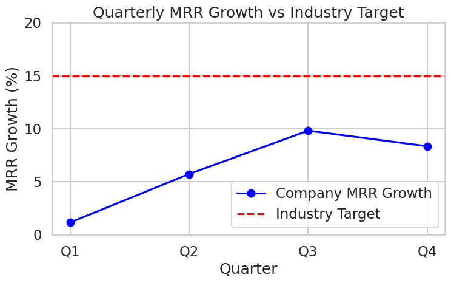

# Supply Chain Correlation Analysis

This repository contains the correlation analysis and Excel heatmap for the automotive supplier performance dataset.

**Email:** 23f2000738@ds.study.iitm.ac.in  

## Files Included
- `correlation.csv` — exported correlation matrix from Excel  
- `heatmap.png` — screenshot of Excel heatmap with Red–White–Green scale  
- `README.md` — documentation file containing required email  

## Steps Followed
1. Enabled Excel Data Analysis ToolPak  
2. Imported dataset into Excel  
3. Data → Data Analysis → Correlation  
4. Selected all 5 supply chain metric columns  
5. Exported correlation matrix to new sheet  
6. Applied conditional formatting (Red → White → Green)  
7. Took screenshot and saved as `heatmap.png`  
8. Exported correlation matrix as `correlation.csv`

# Seaborn Barplot Chart

This repository contains the required Python script and output chart.

**Email:** 23f2000738@ds.study.iitm.ac.in

# Quarterly MRR Growth Analysis - 2024

**Email:** 23f2000738@ds.study.iitm.ac.in

## Data Summary

| Quarter | MRR Growth (%) |
|---------|----------------|
| Q1      | 1.13           |
| Q2      | 5.71           |
| Q3      | 9.8            |
| Q4      | 8.34           |
| **Average** | **6.25**   |

**Industry Target:** 15%

## Key Findings

- The company’s quarterly MRR growth shows a rising trend from Q1 to Q3 but a slight decline in Q4.
- The average quarterly growth (6.25%) is well below the industry benchmark of 15%.
- The gap indicates significant room for improvement to reach the industry standard.

## Business Implications

- Current growth is not sufficient to meet competitive benchmarks.
- Falling short of the target may impact market share, investor confidence, and long-term revenue projections.

## Recommendations

- **Expand into new market segments** to accelerate MRR growth.
- Invest in targeted marketing campaigns to boost customer acquisition.
- Analyze churn and retention metrics to improve existing customer lifetime value.
- Consider product enhancements or pricing strategies to increase revenue per customer.

## Visualization

The trend and benchmark comparison are illustrated in the plot:

